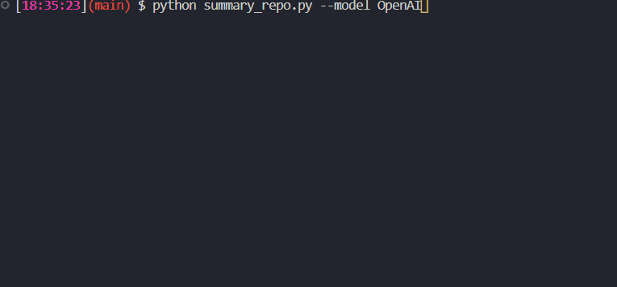

# summaryRepoGPT
A program to summary the content of .ipynb files from a GitHub repo. It generates a markdown file `notebooks_summary.md` inside the repository folder.


```
usage: summary_repo.py [-h] [--local LOCAL] [--model MODEL]

A description

options:
  -h, --help            show this help message and exit
  --local LOCAL, -l LOCAL
                        If the repository has been already downloaded, you can pass the folder path
  --model MODEL, -m MODEL
                        To use a preferred model (OpenAI, FakeLLM for testing, GPT4All)
  --n-threads N_THREADS, -t N_THREADS
                        Number of threads to use, only if model==GPT4All
```

If no local repo is passed, then it will ask for a repo and branch. All repo all download in the folder `repositories`.

By default the model runs with model `FakeLLM`, i.e., it generates a fake summary. To change that use the flag `--model OpenAI`. Currently `GPT4All` is not working.

---

If you want to test only one notebook, you can use **summary_notebook.py**:
```
usage: summary_notebook.py [-h] --file FILE [--model MODEL] [--n-threads N_THREADS]

A description

options:
  -h, --help            show this help message and exit
  --file FILE, -f FILE  Notebook path
  --model MODEL, -m MODEL
                        To use a preferred model (OpenAI, FakeLLM for testing, GPT4All)
  --n-threads N_THREADS, -t N_THREADS
                        Number of threads to use, only if model==GPT4All
```

You can check [`comparison_summary.md`](./example/comparison_summary.md) to check the usage of **summary_notebook.py** over `scipy/effect_size.ipynb` from [donnemartin/data-science-ipython-notebooks](https://github.com/donnemartin/data-science-ipython-notebooks) repo.

 -----
## Example


In this example the repo [donnemartin/data-science-ipython-notebooks](https://github.com/donnemartin/data-science-ipython-notebooks) is clonned and then the `scipy` folder is selected to summarize. Each notebooks is summarized as 
- `00_notebook0.ipynb`: This notebook...
- `01_notebook1.ipynb`: This notebook...

and then the program obtains a final explanation of the repo (or folder in this case) which is written in [`notebooks_summary.md`](./example/notebooks_summary.md) file.

-----
## Environment variables
Rename example.env to .env and edit the variables appropriately.

```
GITHUB_TOKEN: GitHub token used to access to private repos. 
OPENAI_API_KEY= OpenAI API key
GPT4ALL_MODEL= GPT4ALL model name (see https://gpt4all.io/models/models.json for all models)
EMBEDDINGS_MODEL=all-MiniLM-L6-v2
```

# To do list
- [x] Make GPT4ALL work
- [x] Improve notebook splitter
- [ ] Add [llama.cpp](https://github.com/ggerganov/llama.cpp) support
- [ ] Add more files to summarize